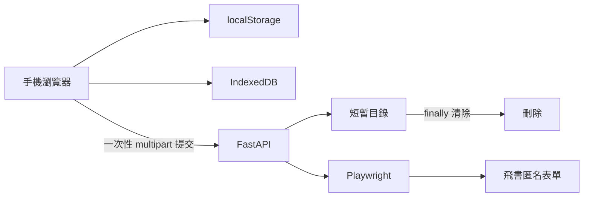

# 手機版雪板申請一鍵提交網站

> 狀態：提案，供下一個實作對話使用  
> 建立日期：2026-09-14  
> 範圍：提供手機使用者第一次設定、後續一鍵提交的網站，不使用帳號登入、瀏覽器擴充功能、每日排程或命令列操作。

## 1. 背景與目標

雪板領取表單目前位於：

```text
https://sunac.feishu.cn/share/base/form/shrcndRhW3v7obxceOEymUijK1b?chunked=false
```

使用者每次申請都會填寫相同的資料：

- 姓名
- 雪板編號
- 雪板照片
- 雪卡正面照片
- 雪卡反面照片

目標是做一個可在手機直接開啟的普通網站：

1. 使用者第一次輸入資料與選擇三張照片。
2. 網站只把資料保存於該使用者的手機瀏覽器。
3. 後續開啟網站時，資料自動恢復。
4. 使用者只需按一次「送出領板申請」。
5. 不要求使用者登入、不要求安裝瀏覽器擴充功能，也不要求每日排程。

這不是個人腳本或定時器。它應可讓同樣有重複填表需求的 Bonski 使用者自行設定並使用。

## 2. 非目標

第一版**不**包含：

- 使用者帳號系統、密碼、社群登入或資料庫帳號資料。
- 後端永久保存姓名、編號或照片。
- 自動每日提交或背景排程。
- 瀏覽器擴充功能。
- 直接使用、保存或重播 `curl.txt` 裡的 Cookie、CSRF Token 或附件 Token。
- 自動略過 CAPTCHA、登入、人工審核或飛書新增的反自動化機制。

## 3. 使用流程

### 3.1 第一次設定

1. 使用者以手機開啟網站。
2. 輸入姓名與雪板編號。
3. 從相簿依序選擇：
   - 雪板照片
   - 雪卡正面照片
   - 雪卡反面照片
4. 網頁在瀏覽器本機重編碼照片，移除 EXIF/GPS 中繼資料。
5. 使用者按「儲存到此裝置」。
6. 顯示已儲存的文字、編號與三張照片預覽。

### 3.2 日後提交

1. 使用者再次開啟網站。
2. 姓名、雪板編號和照片預覽自動出現。
3. 使用者可按「送出領板申請」。
4. 網頁顯示處理中，避免重複點擊。
5. 後端代為完成匿名飛書表單。
6. 網頁清楚顯示「送出成功」或可行動的錯誤訊息。

### 3.3 資料維護

頁面必須提供：

- **編輯資料**：更改姓名、編號或任一張照片。
- **清除本機資料**：刪除本機 `localStorage` 與 IndexedDB 的資料，並要求確認。
- **重新選擇照片**：針對單一照片覆寫既有內容。

使用者必須理解：資料只存在目前手機、目前瀏覽器的網站儲存空間中。使用無痕模式、清除網站資料、改用其他瀏覽器或更換手機後，需要重新設定一次。

## 4. 建議架構



說明：

- **手機瀏覽器**
  - 儲存設定資料及照片。
  - 顯示預覽、狀態及結果。
- **FastAPI**
  - 提供同源的靜態網頁與提交 API。
  - 只在一次提交期間接收 multipart 資料。
  - 不使用資料庫。
- **Playwright**
  - 在後端建立一次性、乾淨的 Chromium `BrowserContext`。
  - 開啟匿名飛書表單，填寫、上傳並送出。
- **短暫目錄**
  - 僅放置該請求處理期間的照片副本。
  - 成功、失敗、逾時或例外時都必須在 `finally` 清除。

### 為何需要後端

一般網站無法從自己的網域直接以瀏覽器 JavaScript 呼叫飛書提交 API：

- 捕獲到的飛書提交回應只允許 `Access-Control-Allow-Origin: https://sunac.feishu.cn`。
- 提交需要飛書頁面當次產生的匿名 Cookie 與 CSRF Token。
- 照片需依飛書頁面目前的預上傳流程處理。

因此網站前端只負責本機保存資料與送出一次性的請求；後端使用真正的匿名瀏覽器流程完成飛書操作。

## 5. 瀏覽器端資料保存

### 5.1 文字欄位

使用 `localStorage` 保存下列 JSON，建議 key：

```text
bonski-board:v1:profile
```

概念資料結構：

```json
{
  "schemaVersion": 1,
  "name": "使用者輸入的姓名",
  "boardNumber": "使用者輸入的雪板編號",
  "updatedAt": "ISO-8601 timestamp"
}
```

### 5.2 照片欄位

使用 IndexedDB 保存已去中繼資料的 `Blob`，建議：

```text
database: bonski-board
object store: photos
keys: board, cardFront, cardBack
```

每筆資料只需要保存：

- 處理後的 JPEG Blob
- MIME type
- 照片角色（`board`、`cardFront`、`cardBack`）
- 更新時間

不要保存原始相簿名稱、GPS、EXIF、設備型號或不必要的使用者資料。

### 5.3 本機照片清理

使用者選擇圖片後，前端應：

1. 驗證檔案是可解碼的 JPEG、PNG 或 WebP。
2. 依照照片 EXIF 方向正確旋轉。
3. 以 Canvas 或等效 API 重新輸出 JPEG。
4. 將最長邊限制為合理上限（建議 2048 px），不得放大低解析度圖片。
5. 以足夠辨識會員卡的品質輸出（建議 JPEG quality `0.90–0.92`）。
6. 將重編碼後的 Blob 放入 IndexedDB。

Canvas 重編碼不會保留原始 EXIF/GPS。伺服器仍必須再次以 Pillow 或等效方式重新編碼，作為防禦性處理。

## 6. 後端 API

### 6.1 端點

| 方法 | 路徑 | 說明 |
| --- | --- | --- |
| `GET` | `/` | 提供手機優先的單頁網頁 |
| `GET` | `/healthz` | 容器健康檢查 |
| `POST` | `/api/submissions` | 接收一次性的資料並代送飛書 |

### 6.2 `POST /api/submissions`

使用 `multipart/form-data`，精確接受以下欄位：

| 欄位 | 類型 | 規則 |
| --- | --- | --- |
| `name` | text | 必填，設置長度及字元限制 |
| `board_number` | text | 必填，設置長度及字元限制 |
| `board_photo` | file | 必填，一張照片 |
| `card_front_photo` | file | 必填，一張照片 |
| `card_back_photo` | file | 必填，一張照片 |

API 不應接受任意欄位、任意 URL 或由客戶端指定的飛書端點。

### 6.3 回應

成功範例：

```json
{
  "ok": true,
  "message": "申請已送出。"
}
```

失敗時回傳固定且不洩漏個資的錯誤碼，例如：

- `validation_failed`
- `unsupported_image`
- `image_too_large`
- `form_layout_changed`
- `upload_failed`
- `submit_failed`
- `submit_timeout`
- `rate_limited`

日誌和 API 回應都不得回傳姓名、編號、Cookie、CSRF Token、附件 Token、飛書 response body 或照片內容。

## 7. 飛書匿名表單自動化

### 7.1 已確認的技術事實

由 `curl.txt` 及一次新鮮匿名 GET 已確認：

- 此表單不需要使用者登入。
- GET 表單頁面可取得 HTTP `200`。
- 飛書會產生匿名工作階段 Cookie，其中包含：
  - `_csrf_token`
  - `is_anonymous_session`
  - `sl_session`
- 捕獲到的提交端點為：

  ```text
  POST /space/api/bitable/share/content
  ```

- 捕獲到的成功回應結構包含：

  ```json
  {
    "code": 0,
    "data": {
      "canSubmitAgain": true
    }
  }
  ```

- 捕獲到的 payload 有五個欄位：
  - 兩個文字欄位
  - 一個單選欄位（沿用飛書頁面的預設值）
  - 一個單張附件欄位
  - 一個雙附件欄位
- 提交時使用 `preUploadEnable: true`，表示附件會先走飛書的預上傳流程。

### 7.2 後端 Playwright 流程

每一個 API 請求必須：

1. 建立全新的 Playwright Chromium `BrowserContext`。
2. 開啟固定的表單 URL。
3. 等候表單資料與上傳控制項真正可操作。
4. 用穩定的標籤、可存取名稱或已驗證欄位識別碼定位：
   - 姓名欄位
   - 雪板編號欄位
   - 雪板照片上傳欄位
   - 雪卡照片上傳欄位
   - 送出按鈕
5. 填入姓名及雪板編號。
6. 不操作額外單選欄位，讓飛書網頁保留其預設值。
7. 上傳：
   - 雪板照片：1 張
   - 雪卡照片：正、反面共 2 張
8. 等待每張附件的上傳完成，並確認預覽或上傳完成狀態。
9. 點擊送出。
10. 等待飛書 `/space/api/bitable/share/content` 的提交回應。
11. 僅在 HTTP 成功且 JSON `code == 0` 時回報成功。
12. 關閉 context，清理所有暫存檔。

### 7.3 選擇器要求

實作者不可只依賴易變的 CSS class 或盲目的 input 順序。

應先以實際匿名表單 DOM 確認欄位標籤和可存取名稱，並在程式中驗證：

- 可找到剛好兩個所需文字欄位。
- 可找到一個單張與一個多張附件控制項。
- 多張附件控制項接受兩張圖片。
- 額外單選欄位保留預設值。
- 送出前文字與附件計數完全正確。

已從捕獲的 payload 推斷出的飛書欄位 ID 可以作為診斷線索，但首次實作時必須重新在 live DOM 驗證，不應把它們視為永久 API 契約：

| 類型 | 捕獲欄位 ID | 狀態 |
| --- | --- | --- |
| 文字欄位 | `fldZJlD0Ox` | 疑似姓名，需驗證 |
| 文字欄位 | `fldRpJzAGC` | 疑似雪板編號，需驗證 |
| 單選 | `fldFD4KWOC` | 使用飛書預設值 |
| 單張附件 | `fldBBvxZS1` | 疑似雪板照片，需驗證 |
| 雙附件 | `fldP0AVcVb` | 疑似雪卡正反面，需驗證 |

### 7.4 失敗原則

發生以下任一情況時，直接失敗並回報可理解的錯誤，不得盲目送出：

- 表單欄位不存在、名稱不符或結構改變。
- 預設單選欄位不存在或不可用。
- 任一附件上傳未完成。
- 附件數量不是 `1 + 2`。
- 飛書回應缺少成功碼或回傳非零 `code`。
- Playwright 等候逾時。

## 8. 隱私與安全

### 8.1 資料生命週期

| 資料 | 保存位置 | 保存時間 |
| --- | --- | --- |
| 姓名、雪板編號 | 使用者瀏覽器 `localStorage` | 到使用者清除為止 |
| 三張處理後照片 | 使用者瀏覽器 IndexedDB | 到使用者清除為止 |
| 提交用照片副本 | 後端暫存目錄 | 單一請求期間 |
| 匿名 Cookie / CSRF Token | Playwright 記憶體 | 單一請求期間 |
| 永久伺服器資料庫 | 不使用 | 不適用 |

### 8.2 後端防護

第一版至少應包含：

- 請求大小上限。
- 檔案數量、MIME type、可解碼性與尺寸驗證。
- 伺服器端重新編碼，去除原圖內的 EXIF/GPS。
- 逾時與單一提交並行數上限。
- 依 IP 的基本速率限制。
- 同源 `Origin` 驗證，以及給頁面使用的 CSRF 防護或要求自訂請求 header。
- 靜態資源和 API 都加上適當的安全回應 header。
- 日誌脫敏。

若服務從僅限信任的區域網路擴大到公網，必須再加上：

- HTTPS。
- 合理的反向代理與防火牆。
- 更完整的濫用防護（例如速率限制、邀請碼或 CAPTCHA）。
- 明確的隱私告知。

### 8.3 重要限制

後端雖然不保存資料，但它在使用者按送出時會短暫接收姓名、編號和照片，並上傳給飛書。網站必須在提交按鈕附近明確告知此事。

即使使用者選擇「只保存、不送出」，保存到本機的照片仍可能被同一台手機、同一個瀏覽器 profile 的其他使用者看見。因此「清除本機資料」必須明顯且可用。

## 9. 手機前端與 PWA

介面應採手機優先、單頁、少步驟設計：

- 表單分成「基本資料」與「照片」兩區。
- 每張照片應有角色標籤、預覽、更換、刪除。
- 未完成設定時，停用提交按鈕並提示缺少項目。
- 提交時顯示不可重複點擊的 loading 狀態。
- 成功和失敗訊息要有高對比、可存取的文字提示。

可提供 `manifest.webmanifest` 與 service worker，使支援 HTTPS 的環境能「加到主畫面」。但核心功能不得依賴 PWA 安裝：

- 以區域網路 `http://<Mac-IP>:8080` 開啟時，`localStorage` 和 IndexedDB 的核心保存流程仍必須可用。
- service worker / 可安裝 PWA 通常需要 HTTPS（或 localhost），因此「加到主畫面」是 HTTPS 部署後的增強功能，而不是第一版必要功能。

## 10. Docker Compose 部署

### 10.1 運行環境

使用者提供的 Docker 路徑：

```text
/Users/league2eb/.local/bin/docker
```

此路徑已確認連到 OrbStack Docker，Docker server 為 Linux `arm64`，Compose 版本為 `v5.1.2`。

映像必須在 ARM64 環境實際驗證可建置與可執行。

### 10.2 預計檔案結構

```text
BonskiBoard/
├── app/
│   ├── main.py
│   ├── feishu.py
│   ├── images.py
│   ├── settings.py
│   └── static/
│       ├── index.html
│       ├── app.js
│       ├── styles.css
│       ├── manifest.webmanifest
│       └── service-worker.js
├── tests/
├── pic/                       # 僅本機 dry-run 驗證資料，不納入公開映像
├── Dockerfile
├── compose.yaml
├── requirements.txt
├── .dockerignore
├── .gitignore
├── .env.example
├── README.md
└── PROPOSED_SPECIFICATION.md
```

### 10.3 容器組成

- 使用包含相容 Chromium 系統依賴的 Playwright Python 基底映像。
- 鎖定 Python Playwright 套件與瀏覽器映像相容版本。
- FastAPI/ASGI 服務監聽容器 `8080`。
- Compose 對主機暴露 `8080`。
- 設定 Chromium 所需的共享記憶體空間或等效安全設定。
- 設定健康檢查 `GET /healthz`。
- 以 `restart: unless-stopped` 維持網站服務。
- 不掛載保存使用者資料的資料庫 volume。

### 10.4 本機啟動

```bash
/Users/league2eb/.local/bin/docker compose up -d --build
```

區域網路手機以：

```text
http://<Mac 的區域網路 IP>:8080
```

開啟服務。

若服務要提供給不在同一區域網路的 Bonski 使用者，後續需部署具有 HTTPS 的網域與反向代理。第一版不應直接把未受保護的本機 `8080` 連接埠暴露到公開網際網路。

## 11. 現有本機測試照片

目前工作區有：

```text
pic/board.jpeg
pic/card_font.jpeg
pic/card_back.jpeg
```

它們可用於**僅本機**的 UI 與 dry-run 驗證，對應如下：

| 檔案 | 角色 |
| --- | --- |
| `board.jpeg` | 雪板照片 |
| `card_font.jpeg` | 雪卡正面照片 |
| `card_back.jpeg` | 雪卡反面照片 |

這些檔案包含影像中繼資料，且不應被打包至公開 Docker image、提交至版本控制，或當作其他使用者的預設照片。

## 12. 驗證策略

### 12.1 自動測試

- 前端：
  - 姓名、編號可保存並在重整後恢復。
  - 三張照片 Blob 可在 IndexedDB 保存與恢復。
  - 清除資料會同時移除 `localStorage` 與 IndexedDB。
  - 未完成四項資料時提交按鈕不可用。
- 圖片：
  - 前端與後端重編碼輸出不含 EXIF/GPS。
  - 無效圖片、太大檔案和錯誤照片數量被拒絕。
- API：
  - 輸入驗證、大小限制、速率限制及錯誤碼。
  - 暫存目錄在成功、失敗、例外及逾時後都會被刪除。
- 後端流程：
  - 對 Playwright 層做 mock，驗證欄位與照片角色對應。

### 12.2 手動 dry-run

第一個實作版本必須提供 `DRY_RUN=true`：

1. 實際開啟飛書匿名表單。
2. 實際填入資料並上傳附件。
3. 在點擊「送出」前停止。
4. 回傳 `dry_run_complete`。

注意：由於飛書採預上傳機制，dry-run 仍可能暫時上傳附件到飛書，但不應建立正式表單紀錄。

### 12.3 正式驗證

正式提交只能由使用者透過網頁明確按下按鈕觸發。實作者或自動測試不得自行建立正式雪板申請。

成功的最小驗證條件：

1. 使用者第一次在手機儲存資料。
2. 重新整理網站後，資料和三張照片預覽仍存在。
3. dry-run 完成填寫和上傳，未送出正式紀錄。
4. 使用者明確確認後，單次正式提交取得飛書 `code == 0`。
5. 後端暫存目錄在完成後為空，日誌沒有個資或 token。

## 13. 實作前仍需確認的事項

下一個實作對話應在不提交正式表單的前提下確認：

1. 表單中的可存取標籤、精確欄位對應與上傳控制項。
2. 單選欄位的預設選項是否在匿名新工作階段仍可用。
3. 飛書的成功頁面與網路回應在目前版本是否維持現有結構。
4. 官方 Playwright Python Docker image 在提供的 ARM64 OrbStack 環境可否直接建置；若否，選擇有 ARM64 支援的等效基底映像。
5. 網站的實際部署位置：僅區域網路，或具 HTTPS 的公開網域。

## 14. 完成定義

下列條件全部達成才算完成第一版：

- 手機使用者無需登入、無需擴充功能、無需命令列。
- 第一次設定後，姓名、雪板編號和三張照片可在同一瀏覽器自動恢復。
- 使用者能編輯或清除本機資料。
- 後端不永久保存個資、照片、Cookie 或 Token。
- 後端能使用乾淨匿名瀏覽器執行飛書流程。
- 表單結構異常時安全失敗，不會盲目送出。
- Docker Compose 可在提供的 ARM64 OrbStack 環境啟動。
- dry-run 已驗證，但正式提交只在使用者明確點擊後發生。
